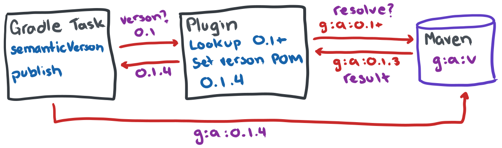

<!-- Generated with https://github.com/thlorenz/doctoc -->
<!-- doctoc docs/README.md >

<!-- START doctoc generated TOC please keep comment here to allow auto update -->
<!-- DON'T EDIT THIS SECTION, INSTEAD RE-RUN doctoc TO UPDATE -->
**Table of Contents**

- [Change Log](#change-log)
- [Usage](#usage)
  - [Auto mode](#auto-mode)
  - [Manual mode](#manual-mode)
- [Gradle Version Requirement](#gradle-version-requirement)

<!-- END doctoc generated TOC please keep comment here to allow auto update -->

Gradle plugin to auto-increments the patch version on each call to the `publish` task by looking up the most recent version published in the publishing maven repository and adds it by one.

Tested to work in the following scenarios:

* Single root project publication
* Single and multiple subprojects publication
* BOM references via `api(platform(project(":bom")))` and `java-platform` plugin
* Manual versioning, prevents the task from publishing if the version isn't different from the one in maven



## Change Log

See [releases](https://github.com/countableSet/semantic-version-plugin/releases) for changes.

## Usage

[Plugins Portal](https://plugins.gradle.org/plugin/dev.poolside.gradle.semantic-version)

```kotlin
plugins {
  `maven-publish`
  id("dev.poolside.gradle.semantic-version") version "{version}"
}
```

```sh
$ ./gradlw publish
[...]
> Task :semanticVersion
Resolved published version of 'dev.poolside.test:my-library:0.1.4' to '0.1.5'
[...]
```

### Auto mode

Basic full example, but it can also be used for subprojects and bom subprojects. However, make sure the publication version number is in the format of `[\d]+\.[\d]+`.

```kotlin
plugins {
  java
  `maven-publish`
  id("dev.poolside.gradle.semantic-version") version "{version}"
}
repositories {
  mavenCentral()
}

group = "dev.poolside.test"
version = "0.1"

publishing {
  publications {
    create<MavenPublication>("mavenJava") { 
      artifactId = "my-library"
      from(components["java"])
    }
  }
}
```

### Manual mode

If there's a scenario in which you want to manually increment the semantic version. Therefore, the plugin will disable publishing if the version already exists in the repository.

```kotlin
semanticVersion {
  manual = true
}
```

## Gradle Version Requirement

The plugin now requires Gradle version 8.13+ to access new methods and public api changes from gradle.

```sh
❯ gr semanticVersion
> Task :client:semanticVersion FAILED

FAILURE: Build failed with an exception.

* What went wrong:
  Execution failed for task ':client:semanticVersion'.
> org/gradle/api/internal/initialization/StandaloneDomainObjectContext

* Try:
> Run with --stacktrace option to get the stack trace.
> Run with --info or --debug option to get more log output.
> Run with --scan to get full insights.
> Get more help at https://help.gradle.org.

BUILD FAILED in 1s
2 actionable tasks: 2 executed
```
